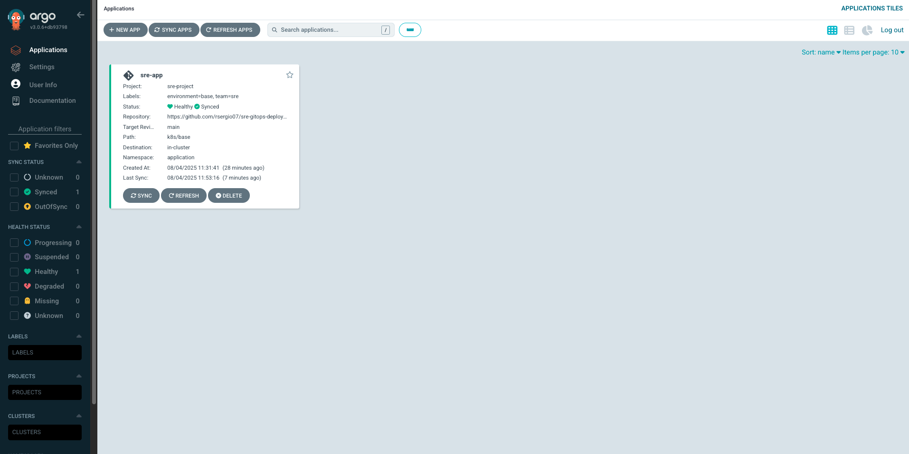
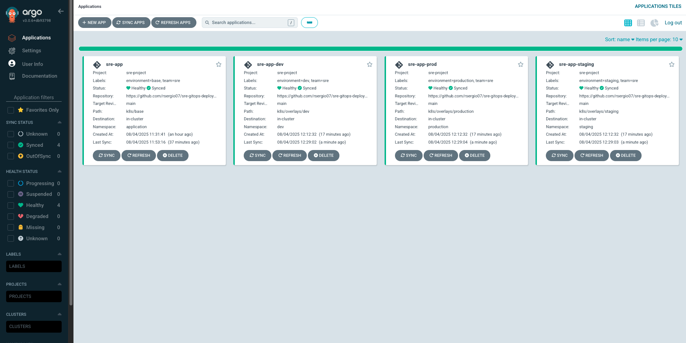
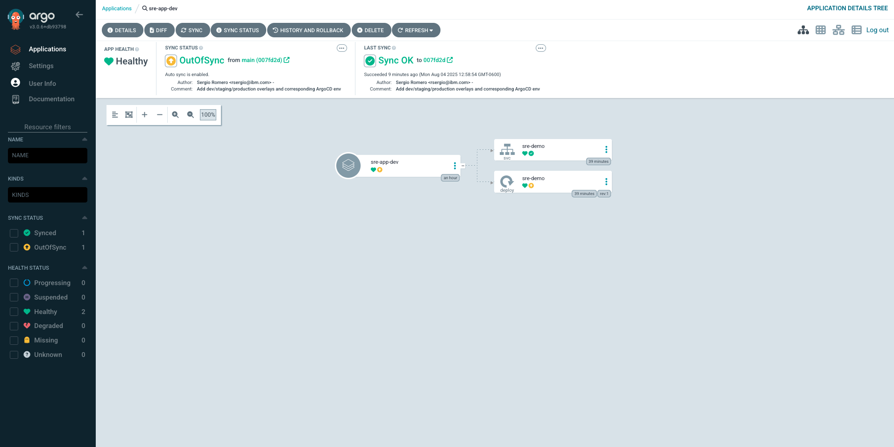

# **Automating Kubernetes Deployments with ArgoCD**

## **Table of Contents**

* [Scenario: From Pipeline to GitOps](#scenario-from-pipeline-to-gitops)
* [Learning Objectives](#learning-objectives)
* [Reference to Exercise 16](#reference-to-exercise-16)
* [Introduction](#introduction)
* [What is ArgoCD?](#what-is-argocd)
* [Why Use ArgoCD in SRE?](#why-use-argocd-in-sre)
* [Recommended Clean-up and Setup](#recommended-clean-up-and-setup)
* [Prerequisites](#prerequisites)
* [Getting Started: Setup and Repository Initialization](#getting-started-setup-and-repository-initialization)
* [Phase 1: Install and Access ArgoCD](#phase-1-install-and-access-argocd)
* [Phase 2: Define GitOps Project and Application](#phase-2-define-gitops-project-and-application)
* [Phase 3: Multi-Environment GitOps Strategy](#phase-3-multi-environment-gitops-strategy)
* [Phase 4: Monitoring and Troubleshooting](#phase-4-monitoring-and-troubleshooting)
* [Expected Outcome](#expected-outcome)
* [Next Steps](#next-steps)

---

## **Scenario: From Pipeline to GitOps**

In Exercise 16, you built a CI/CD pipeline that tested, validated, and simulated deployments to staging and production environments. Now, in a real SRE environment, you would want those production changes to be managed declaratively through GitOps.

**GitOps bridges the gap between CI and CD** by ensuring that whatever lives in Git is what gets deployed and maintained in your Kubernetes clusters.

In this exercise, you will use **ArgoCD** to deploy the same application introduced earlier—but now as a fully GitOps-managed workload across multiple environments with advanced deployment patterns.

**Real-World Context:** Large-scale SRE teams rely on GitOps patterns to manage thousands of microservices across hundreds of clusters. This exercise simulates those enterprise patterns in a controlled environment.

---

## **Learning Objectives**

By the end of this exercise, you will be able to:

* Install and configure ArgoCD in a Kubernetes cluster
* Understand core GitOps principles and how ArgoCD implements them
* Create and manage ArgoCD Projects and Applications
* Bootstrap declarative desired state from scratch (Kustomize base and overlays)
* Implement a multi-environment strategy (dev, staging, production)
* Monitor application health, sync status, and detect drift
* Troubleshoot common ArgoCD deployment issues
* Apply reliable rollback and self-heal patterns via GitOps

---

## **Reference to Exercise 16**

This exercise is standalone: you can complete the full GitOps workflow with ArgoCD using the provided default image and overlays without any prior work.

If you’ve completed Exercise 16 (the CI/CD pipeline), think of Exercise 17 as the next evolutionary step in delivery:

- Exercise 16 built, tested, and validated artifacts and simulated deployments through an imperative pipeline.
- Exercise 17 takes the idea of “what should be running” and makes it declarative: instead of pushing changes, ArgoCD continuously *pulls* the desired state from Git, detects drift, and self-heals.  
- Rollbacks in Exercise 16 were scripted/simulated; here, reverting Git becomes the real rollback mechanism that ArgoCD enforces automatically.  
- Promotion (dev → staging → production) moves from sequential jobs to environment-specific GitOps applications with controlled sync policies and visibility.  
- Observability is enhanced: ArgoCD surfaces sync/health status, and any divergence from the tested state is visible and correctable without manual cluster intervention.

Completing both gives learners the full story: validated CI artifacts (Exercise 16) and reliable, continuous delivery with reconciliation and drift control (Exercise 17).

---

## **Introduction**

In modern SRE practices, deploying software is no longer a manual task. As systems scale and complexity increases, managing deployments declaratively and automatically becomes essential. This is where **GitOps** and tools like **ArgoCD** come into play.

This exercise introduces **ArgoCD**, a Kubernetes-native continuous delivery tool built on GitOps principles. While CI pipelines (like the one you built in [Exercise 16](../exercise16)) focus on testing and validating code changes, ArgoCD focuses on the **"CD" part of CI/CD** — ensuring that **your Kubernetes cluster always reflects the desired state stored in Git**.

### **GitOps Core Principles**

GitOps is built on four fundamental principles:

1. **Declarative:** The entire system is described declaratively in Git
2. **Versioned and Immutable:** Git provides versioning and immutability
3. **Pulled Automatically:** Software agents automatically pull changes from Git
4. **Continuously Reconciled:** Software agents ensure the cluster matches Git state

You'll deploy ArgoCD into your Minikube cluster, configure it to sync from your GitHub repository, and define GitOps resources such as `AppProject` and `Application` manifests. The lab guides you through implementing a multi-environment strategy (dev, staging, production), detecting configuration drift, and using both the CLI and UI to monitor and troubleshoot deployment issues.

This foundational GitOps workflow will help you understand how tools like ArgoCD enhance reliability, visibility, and automation in production environments.

---

## **What is ArgoCD?**

**ArgoCD** stands for *Argo Continuous Delivery*. It is part of the [Argo Project](https://argo-cd.readthedocs.io/), a suite of open-source tools designed for Kubernetes-native workflows.

### **Key Features:**

- **Declarative:** You define your desired state in YAML (Kubernetes manifests), store it in Git, and ArgoCD ensures your cluster matches it
- **Git as the Source of Truth:** All deployment configurations live in Git, and ArgoCD watches for changes
- **Pull-Based Model:** Unlike push-based pipelines, ArgoCD uses a **pull model**, which means it runs *inside* your cluster and continuously reconciles based on Git
- **Self-Healing:** If someone manually modifies the cluster (i.e., drifts from the declared state), ArgoCD can automatically revert those changes to match Git
- **Visual Dashboard & CLI:** ArgoCD provides a clean UI for monitoring sync status and health, and a powerful CLI (`argocd`) for automation and scripting
- **Multi-Cluster Management:** ArgoCD can manage applications across multiple Kubernetes clusters from a single control plane
- **RBAC Integration:** Fine-grained role-based access control for teams and environments

### **ArgoCD Architecture:**

ArgoCD consists of several components:

- **API Server:** Exposes the API consumed by Web UI, CLI, and CI/CD systems
- **Repository Server:** Internal service that maintains a local cache of Git repositories
- **Application Controller:** Kubernetes controller that continuously monitors running applications and compares the current, live state against the desired target state
- **Redis:** Used for caching and as a message broker
- **Dex (Optional):** Identity service for SSO integration
- **ApplicationSet Controller:** Manages multiple ArgoCD applications automatically

### **How it Works:**

ArgoCD deploys a **controller** inside the Kubernetes cluster. You define:

- A **Project**, which defines boundaries (e.g., allowed repos, namespaces, clusters)
- An **Application**, which points to a Git repo, a path, and a target revision (usually `main`)

ArgoCD will then:

1. Clone the repo and cache it locally
2. Compare the declared manifests with the current state in the cluster
3. Apply changes if there's any difference (sync)
4. Continuously monitor for both Git changes and cluster drift
5. Report health status and sync state through UI and metrics

> **Note:** ArgoCD is not just a deployment tool — it's an **operational control plane** for your Kubernetes applications.

---

## **Why Use ArgoCD in SRE?**

GitOps introduces a paradigm shift for deployment management, and ArgoCD embodies that shift. Here's why it's critical from an SRE perspective:

### 1. **Deployment Reliability**

In traditional workflows, deployments often rely on ad-hoc scripts or CI pipelines that push changes into clusters. This can lead to inconsistencies or failed rollouts.

With ArgoCD:
- Deployments are repeatable and reproducible across environments
- The system continuously monitors for drift and restores the correct state
- Rollbacks are as simple as reverting a Git commit
- Failed deployments are automatically detected and reported

### 2. **Reduced Toil and Manual Intervention**

SRE teams are often paged for broken deployments or misconfigurations.

Using ArgoCD:
- Reduces the need to SSH into clusters or run manual `kubectl` commands
- Automates correction of configuration drift
- Ensures predictable, Git-reviewed changes
- Provides self-service deployment capabilities for development teams

> **SRE Principle:** Less manual work = less human error = fewer 3 AM pages.

### 3. **Improved Change Auditing and Traceability**

Since all changes are committed to Git:
- You have a full history of what was deployed, when, and by whom
- Troubleshooting is faster — you can correlate incidents with Git commits
- You can perform `git blame` on your cluster state
- Compliance and audit requirements are automatically satisfied

### 4. **Collaboration Across Teams**

With GitOps, infra teams, app developers, and SREs can collaborate on the same repo using Git workflows (PRs, reviews, tagging). No need for separate CI/CD logic per team.

- **Developers** focus on application code and basic manifests
- **SREs** manage infrastructure, policies, and environment-specific configurations
- **Security teams** can review and approve changes through Git workflows

### 5. **Disaster Recovery and Consistency**

ArgoCD enables disaster recovery by allowing clusters to be restored by re-applying Git manifests. This is essential for teams managing multiple clusters or regions.

- **Multi-region deployments** can be kept in sync automatically
- **Cluster rebuilds** become trivial when everything is declarative
- **Environment parity** is maintained through shared manifests and environment-specific overlays

### 6. **Observability and Metrics**

ArgoCD provides comprehensive observability into your deployment pipeline:
- **Application health** monitoring with custom health checks
- **Sync status** tracking across all applications and environments
- **Prometheus metrics** for alerting and dashboards
- **Event logging** for troubleshooting and analysis

---

## **Recommended Clean-up and Setup**

### Clean-up (only if you have a broken/stale local cluster)

```bash
# Remove all Minikube profiles and purge its state
minikube delete --all --purge

# Remove Colima instance and its data
colima delete
```

### Fresh Start

```bash
# Start Colima with Docker runtime
colima start --runtime docker

# Use Colima's Docker for Minikube
minikube start --driver=docker

# Verify cluster health
minikube status

# Confirm node is Ready
kubectl get nodes
```

Once those succeed, your local cluster is clean and healthy—proceed to ArgoCD installation.

---

## **Prerequisites**

### Required Infrastructure

* A working Minikube (or comparable Kubernetes) cluster with >=4GB RAM and 2 CPUs
* A public GitHub repository you control
* `kubectl` installed and configured to talk to your cluster

### Required Tools

* ArgoCD CLI installed (example for macOS):

  ```bash
  brew install argocd
  ```

---

## **Getting Started: Setup and Repository Initialization**

This exercise differs from previous ones: you will create all declarative manifests and overlays from scratch, giving you hands-on intuition about GitOps structure.

### Step 1: Prepare Your Repository

#### Create a New GitHub Repository

1. Go to [https://github.com/new](https://github.com/new)
2. Repository name: `sre-gitops-deployments`
3. Visibility: Public (recommended)
4. Leave “Initialize this repository with a README” unchecked
5. Create repository

#### Local Workspace

```bash
mkdir -p ~/Projects/sre-gitops-deployments
cd ~/Projects/sre-gitops-deployments
```

> **Reminder:** Almost every command must be run from this directory. Run `pwd` to confirm you are inside `~/Projects/sre-gitops-deployments` before proceeding.

### Step 2: Initialize Git and Push to GitHub

```bash
git init
git add .  # stages whatever exists (you'll add overlays/manifests next)
git commit -m "Initial commit - GitOps deployment manifests for ArgoCD"
```

Link to your remote:

```bash
git remote add origin https://github.com/YOUR-USERNAME/sre-gitops-deployments.git
```

*Replace `YOUR-USERNAME` with your GitHub username.*

Rename the branch and push:

```bash
git branch -M main
git push -u origin main
```

*Sets upstream so future pushes/pulls are simple.*

> ❗ If you see `rejected: fetch first`, then the remote already has commits; integrate with:

```bash
git pull --rebase origin main
git push origin main
```

Or if you understand the overwrite risk:

```bash
git push --force origin main
```

---

## **Phase 1: Install and Access ArgoCD**

### Step 1 – Install ArgoCD

```bash
kubectl create namespace argocd
kubectl apply -n argocd -f https://raw.githubusercontent.com/argoproj/argo-cd/stable/manifests/install.yaml
```

Wait for pods to be ready:

```bash
kubectl get pods -n argocd
```

**Expected:** All ArgoCD components should be in `Running` state, e.g.:

```
argocd-application-controller         1/1 Running
argocd-applicationset-controller      1/1 Running
argocd-dex-server                    1/1 Running
argocd-notifications-controller      1/1 Running
argocd-redis                         1/1 Running
argocd-repo-server                  1/1 Running
argocd-server                       1/1 Running
```

### Step 2 – Access the ArgoCD Dashboard

Start port forwarding (keep this running in its own terminal):

```bash
kubectl port-forward svc/argocd-server -n argocd 8080:443 &
```

**In a separate terminal** (so port-forward stays alive), verify connectivity:

```bash
curl -k https://localhost:8080/api/version
```

Then open a browser to: `https://localhost:8080`

> Accept the self-signed cert warning—expected in local/dev setups.

### Step 3 – Retrieve Admin Credentials

Ensure port-forward is active (see step above), then:

```bash
export ARGOCD_PASSWORD=$(kubectl -n argocd get secret argocd-initial-admin-secret -o jsonpath="{.data.password}" | base64 --decode)
echo "ArgoCD Admin Password: $ARGOCD_PASSWORD"
```

### Step 4 – Login via CLI

Run in a separate terminal (so both CLI and port-forward coexist):

```bash
argocd login localhost:8080 \
  --username admin \
  --password "$ARGOCD_PASSWORD" \
  --insecure
```

* Alternatively, omit `--password` to be prompted interactively if you prefer not to export.

Verify login:

```bash
argocd account get-user-info
```

### Step 5 – Initial Dashboard Exploration

In the UI you should see:

* Empty dashboard (no applications yet)
* Navigation for Applications, Settings, etc.
* Cluster information showing connection to local Kubernetes

> **Pro tip:** Bookmark this UI; you’ll revisit it for health, sync, diffs, and drift.

---

## **Phase 2: Define GitOps Project and Application**

You’ll bootstrap a minimal desired state (deployment + service), then expose it to ArgoCD via a Project and Application.

### Step 1 – Create the Application Namespace

```bash
kubectl create namespace application
kubectl get namespaces | grep application
```

### Step 2 – Bootstrap the Minimal Deployment Manifests

Create base resources that represent the declared state:

```bash
mkdir -p k8s/base
cat <<EOF > k8s/base/deployment.yaml
apiVersion: apps/v1
kind: Deployment
metadata:
  name: sre-demo
spec:
  replicas: 1
  selector:
    matchLabels:
      app: sre-demo
  template:
    metadata:
      labels:
        app: sre-demo
    spec:
      containers:
        - name: sre-demo
          image: docker.io/library/nginx:stable
          ports:
            - containerPort: 80
EOF

cat <<EOF > k8s/base/service.yaml
apiVersion: v1
kind: Service
metadata:
  name: sre-demo
spec:
  selector:
    app: sre-demo
  ports:
    - protocol: TCP
      port: 80
      targetPort: 80
  type: ClusterIP
EOF

cat <<EOF > k8s/base/kustomization.yaml
resources:
  - deployment.yaml
  - service.yaml
EOF
```

> **Note:** Base uses 1 replica. Later overlays (dev) will modify this to demonstrate environment-specific variation.

### Step 3 – Create ArgoCD Project and Application Manifests

> **Reminder:** Replace `YOUR-USERNAME` below with your actual GitHub username so `repoURL` points to your repository.

```bash
mkdir -p argocd
```

#### AppProject definition

```bash
cat <<EOF > argocd/project.yaml
apiVersion: argoproj.io/v1alpha1
kind: AppProject
metadata:
  name: sre-project
  namespace: argocd
  finalizers:
    - resources-finalizer.argocd.argoproj.io
spec:
  description: SRE GitOps Project for multi-environment deployments

  sourceRepos:
    - https://github.com/YOUR-USERNAME/sre-gitops-deployments

  destinations:
    - namespace: application
      server: https://kubernetes.default.svc
    - namespace: dev
      server: https://kubernetes.default.svc
    - namespace: staging
      server: https://kubernetes.default.svc
    - namespace: production
      server: https://kubernetes.default.svc

  roles:
    - name: dev-team
      description: Limited development access
      policies:
        - p, proj:sre-project:dev-team, applications, get, sre-project/*, allow
        - p, proj:sre-project:dev-team, applications, sync, sre-project/*dev*, allow
      groups:
        - sre-developers

    - name: sre-team
      description: Full SRE access
      policies:
        - p, proj:sre-project:sre-team, applications, *, sre-project/*, allow
        - p, proj:sre-project:sre-team, repositories, *, *, allow
      groups:
        - sre-admins

  clusterResourceWhitelist:
    - group: ""
      kind: Namespace
  namespaceResourceWhitelist:
    - group: apps
      kind: Deployment
    - group: ""
      kind: Service
    - group: ""
      kind: ConfigMap
    - group: ""
      kind: Secret
EOF
```

#### Application definition (base)

```bash
cat <<EOF > argocd/app.yaml
apiVersion: argoproj.io/v1alpha1
kind: Application
metadata:
  name: sre-app
  namespace: argocd
  finalizers:
    - resources-finalizer.argocd.argoproj.io
  labels:
    environment: base
    team: sre
spec:
  project: sre-project

  source:
    repoURL: https://github.com/YOUR-USERNAME/sre-gitops-deployments
    targetRevision: main
    path: k8s/base

  destination:
    server: https://kubernetes.default.svc
    namespace: application

  syncPolicy:
    automated:
      prune: true
      selfHeal: true
    syncOptions:
      - CreateNamespace=true
      - PrunePropagationPolicy=foreground
      - PruneLast=true
    retry:
      limit: 5
      backoff:
        duration: 5s
        factor: 2
        maxDuration: 3m

  revisionHistoryLimit: 10
EOF
```

### Step 4 – Persist the Base Manifests

```bash
git add k8s/base/deployment.yaml k8s/base/service.yaml k8s/base/kustomization.yaml
git commit -m "Add base manifests for sre-demo app"
git push origin main
```

> Ensure the push completes so ArgoCD sees the latest desired state.

### Step 5 – Apply the Manifests

```bash
kubectl apply -f argocd/project.yaml
kubectl get appproject -n argocd
kubectl apply -f argocd/app.yaml
kubectl get application -n argocd
```

### Step 6 – Sync and Validate

```bash
argocd app list
argocd app get sre-app
argocd app sync sre-app
argocd app wait sre-app --timeout 300
```

Validate the live cluster:

```bash
kubectl get all -n application
kubectl logs -n application deployment/sre-demo
```

### ✅ Quick Checkpoint

* `argocd app list` shows `sre-app` as **Synced / Healthy**.
* Deployment (`sre-demo`) and Service exist in `application` namespace.
* Pod is running and healthy.

### Visual Confirmation

Expected UI after a successful sync of `sre-app`:



*Caption:* `sre-app` shows **Healthy** and **Synced**, pulling from `k8s/base` on `main`, deploying into the `application` namespace.

---

## **Phase 3: Multi-Environment GitOps Strategy**

Extend the base app into dev, staging, and production using overlays and separate ArgoCD applications.

### Step 1 – Create Environment Namespaces

Run each command one at a time and inspect output before proceeding.

```bash
kubectl create namespace dev
kubectl create namespace staging
kubectl create namespace production

kubectl get namespaces | grep -E "(dev|staging|production)"

kubectl label namespace dev environment=dev
kubectl label namespace staging environment=staging
kubectl label namespace production environment=production
```

### Step 2 – Create Kustomize Overlays

```bash
mkdir -p k8s/overlays/dev k8s/overlays/staging k8s/overlays/production
```

#### Dev overlay (variation: 2 replicas)

```bash
cat <<EOF > k8s/overlays/dev/replica-patch.yaml
apiVersion: apps/v1
kind: Deployment
metadata:
  name: sre-demo
spec:
  replicas: 2
EOF

cat <<EOF > k8s/overlays/dev/kustomization.yaml
resources:
  - ../../base
patchesStrategicMerge:
  - replica-patch.yaml
EOF
```

#### Staging overlay (base behavior)

```bash
cat <<EOF > k8s/overlays/staging/kustomization.yaml
resources:
  - ../../base
EOF
```

#### Production overlay (base behavior)

```bash
cat <<EOF > k8s/overlays/production/kustomization.yaml
resources:
  - ../../base
EOF
```

### Step 3 – Define ArgoCD Applications for Each Environment

Replace `YOUR-USERNAME` with your GitHub username in the `repoURL` values.

```bash
mkdir -p environments
```

#### Dev application

```bash
cat <<EOF > environments/dev-app.yaml
apiVersion: argoproj.io/v1alpha1
kind: Application
metadata:
  name: sre-app-dev
  namespace: argocd
  labels:
    environment: dev
    team: sre
spec:
  project: sre-project
  source:
    repoURL: https://github.com/YOUR-USERNAME/sre-gitops-deployments
    targetRevision: main
    path: k8s/overlays/dev
  destination:
    server: https://kubernetes.default.svc
    namespace: dev
  syncPolicy:
    automated:
      prune: true
      selfHeal: true
    syncOptions:
      - CreateNamespace=true
    retry:
      limit: 5
      backoff:
        duration: 5s
        factor: 2
        maxDuration: 3m
  revisionHistoryLimit: 10
EOF
```

#### Staging application

```bash
cat <<EOF > environments/staging-app.yaml
apiVersion: argoproj.io/v1alpha1
kind: Application
metadata:
  name: sre-app-staging
  namespace: argocd
  labels:
    environment: staging
    team: sre
spec:
  project: sre-project
  source:
    repoURL: https://github.com/YOUR-USERNAME/sre-gitops-deployments
    targetRevision: main
    path: k8s/overlays/staging
  destination:
    server: https://kubernetes.default.svc
    namespace: staging
  syncPolicy:
    syncOptions:
      - CreateNamespace=true
    retry:
      limit: 3
      backoff:
        duration: 10s
        factor: 2
        maxDuration: 5m
  revisionHistoryLimit: 10
EOF
```

#### Production application

```bash
cat <<EOF > environments/prod-app.yaml
apiVersion: argoproj.io/v1alpha1
kind: Application
metadata:
  name: sre-app-prod
  namespace: argocd
  labels:
    environment: production
    team: sre
  annotations:
    argocd.argoproj.io/sync-wave: "2"
spec:
  project: sre-project
  source:
    repoURL: https://github.com/YOUR-USERNAME/sre-gitops-deployments
    targetRevision: main
    path: k8s/overlays/production
  destination:
    server: https://kubernetes.default.svc
    namespace: production
  syncPolicy:
    syncOptions:
      - CreateNamespace=true
      - PrunePropagationPolicy=foreground
      - PruneLast=true
    retry:
      limit: 3
      backoff:
        duration: 30s
        factor: 2
        maxDuration: 10m
  revisionHistoryLimit: 20
EOF
```

### Step 4 – Commit and Push Overlays and Environment Applications

```bash
git add k8s/overlays environments
git commit -m "Add dev/staging/production overlays and corresponding ArgoCD environment applications"
git push origin main
```

### Step 5 – Apply Environment Applications

```bash
kubectl apply -f environments/dev-app.yaml
kubectl apply -f environments/staging-app.yaml
kubectl apply -f environments/prod-app.yaml

kubectl get applications -n argocd
```

### Step 6 – Sync and Promote

```bash
argocd app sync sre-app-dev       # auto-sync due to automated policy
argocd app sync sre-app-staging   # manual promote
argocd app sync sre-app-prod      # manual promote
argocd app list
```

### Quick Expected Result

* `sre-app-dev`: **Synced / Healthy** in `dev`, reflecting 2 replicas.
* `sre-app-staging` & `sre-app-prod`: After sync, each deploys to their namespaces.
* Verify with:

  ```bash
  kubectl get all -n dev
  kubectl get all -n staging
  kubectl get all -n production
  ```

### Visual Confirmation

Expected UI after successful multi-environment sync:



*Caption:* All four applications are **Healthy / Synced** with appropriate overlays applied.

---

## **Phase 4: Monitoring and Troubleshooting**

You will validate health, surface drift, and learn how to diagnose problems using CLI and UI.

### Step 1 – Check Application Status and Health

> Run commands one at a time and pause to understand the output. Instructors can use these to prompt discussion.

#### Using ArgoCD CLI

```bash
argocd app list
argocd app get sre-app-dev
argocd app history sre-app-dev
argocd app resources sre-app-dev
```

#### Using kubectl (ArgoCD CRDs)

```bash
kubectl get applications -n argocd \
  -o custom-columns="APP:.metadata.name,SYNC:.status.sync.status,HEALTH:.status.health.status,MESSAGE:.status.conditions[0].message"

# Fallback if you don’t have yq
kubectl get application sre-app-dev -n argocd -o yaml
# Or with yq (recommended for clarity):
# brew install yq
kubectl get application sre-app-dev -n argocd -o yaml | yq eval '.status' -
```

### Step 2 – Monitor Events and Controller Logs

> Run each block sequentially, inspect, then proceed.

#### 2.1 – ArgoCD application-specific events

```bash
kubectl get events -n argocd --field-selector involvedObject.name=sre-app-dev
```

#### 2.2 – Events in each target namespace

```bash
kubectl get events -n dev --sort-by=.lastTimestamp
kubectl get events -n staging --sort-by=.lastTimestamp
kubectl get events -n production --sort-by=.lastTimestamp
```

#### 2.3 – Inspect ArgoCD Application Controller logs

```bash
kubectl get pods -n argocd
# Identify the controller pod (e.g., argocd-application-controller-...)
kubectl get pods -n argocd --selector=app.kubernetes.io/name=argocd-application-controller

# Fetch recent activity (replace <pod-name> accordingly)
kubectl logs -n argocd <pod-name> --tail=50
```

*Note:* These logs show reconciliation decisions, health evaluations, and drift detection.

#### 2.4 – Follow controller logs live for active troubleshooting

```bash
kubectl logs -n argocd -f <pod-name>
```

*Note:* Trigger a sync or introduce drift and watch how ArgoCD responds in real time.

### Step 3 – Simulate and Resolve Configuration Drift

> **Goal:** Diverge live state, observe detection, then reconcile.

#### 3.1 – Introduce drift manually

```bash
kubectl get deployment sre-demo -n dev -o yaml | grep -i replicas -A2
DEPLOYMENT_NAME=$(kubectl get deployment -n dev -o jsonpath='{.items[0].metadata.name}')
kubectl scale deployment "$DEPLOYMENT_NAME" -n dev --replicas=5
kubectl get deployment sre-demo -n dev
```

*Expected:* Because `selfHeal: true` is enabled, ArgoCD may immediately revert to the Git value (1 or 2 depending on overlay); if you want to observe drift persist, temporarily disable self-heal (see below).

#### 3.2 – Observe and Understand Drift

**A. Manual drift detection (disable self-heal to see OutOfSync):**

```bash
kubectl patch application sre-app-dev -n argocd --type merge -p '{"spec":{"syncPolicy":{"automated":{"prune":true,"selfHeal":false}}}}'
# Recreate drift
kubectl scale deployment sre-demo -n dev --replicas=5
argocd app get sre-app-dev
argocd app diff sre-app-dev
```

In the UI, open `sre-app-dev`, observe **OutOfSync** and view the diff highlighting replica mismatch.

### Visual Confirmation

Expected UI when `sre-app-dev` is OutOfSync due to manual drift:



*Caption:* `sre-app-dev` shows **OutOfSync** status, and the Diff view highlights the mismatch in `replicas` between the Git-declared value and the live cluster state. This confirms ArgoCD’s drift detection before reconciliation.

**B. Git-driven desired-state change (self-heal still enabled):**

> **Reminder:** Ensure ArgoCD port-forward is active and you're logged in.

```bash
sed -i '' 's/replicas: 2/replicas: 3/' k8s/overlays/dev/replica-patch.yaml
git add k8s/overlays/dev/replica-patch.yaml
git commit -m "Update dev overlay to 3 replicas"
git push origin main
argocd app sync sre-app-dev
```

*Expected:* New revision is applied; the deployment scales to 3 replicas and status returns to **Synced / Healthy**.

#### 3.3 – Resolve the Drift and Restore Behavior

```bash
# If self-heal was disabled earlier, heal it:
argocd app sync sre-app-dev
# (Optional) Re-enable self-heal:
kubectl patch application sre-app-dev -n argocd --type merge -p '{"spec":{"syncPolicy":{"automated":{"prune":true,"selfHeal":true}}}}'
argocd app get sre-app-dev
kubectl get deployment sre-demo -n dev
```

### Checkpoint for Students

* Manual drift shows **OutOfSync** (unless auto-healed) and appears in diff view.
* Sync (manual or self-heal) restores declared state.
* Git change (replica bump) results in a new applied revision with expected scaling.

---

## **Expected Outcome**

By the end of this exercise, you will have installed and configured ArgoCD in your local Kubernetes cluster, bootstrapped a fully declarative application from scratch, and defined ArgoCD Projects and Applications. You’ll also implement and promote multi-environment overlays, detect and reconcile configuration drift, and apply Git-driven changes with automated reconciliation, gaining full visibility into sync status, health, and controller events.

---

## **Next Steps**

In [Exercise 18](../exercise18), you’ll explore **rollback and recovery** using Kubernetes-native mechanisms and GitOps. You’ll intentionally introduce failures, observe ArgoCD’s behavior, and implement automated recovery — deepening your understanding of resilience through declarative infrastructure.

---
